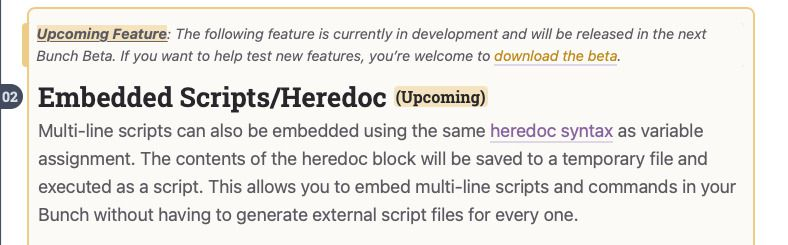
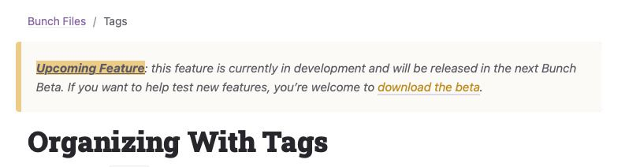
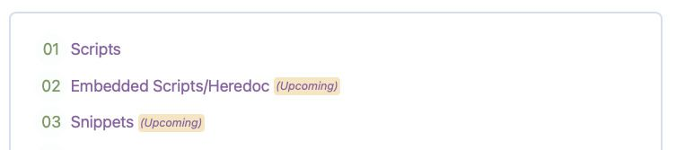

# Feature Availability

Adds markup based on whether the described feature is available in the current release.

Build numbers are retrieved from Sparkle appcasts using the `sparkle:version` attribute of the most recent enclosure's link. The path to the local appcast files are defined in `_config.yml` (see configuration).

This plugin was designed for the [Bunch.app documentation site](https://bunchapp.co). Bunch has two appcasts, one for the release version, and one for the beta version. The build numbers are synced between the two, with the beta build number always equal to or greater than the release build number.

When I add a new feature to the beta, this plugin allows me to include its documentation in the main site with a notice that it's a beta feature (or "upcoming," meaning I've documented but haven't yet pushed the build that includes it). I just mark a feature's documentation with a tag defining the build number the text applies to, and the plugin determines if it's part of the public release, the beta version, or unreleased.

- If the build number specified in the tag is less than or equal to current   release build, no markup is added.
- If it's greater than the stable release and less than or equal to the current beta build, the tag content is considered "beta."
- If it's greater than the current beta build, the tag content is considered "upcoming."

## Configuration

Appcast paths should be to local files. The plugin could be modified to pull in an appcast URL from the web, but I'll leave that up to you.

Templates are ERB format. `<%= content =>` gets block tag contents, `<%= min_version =>` gets the build number. If you want to use the default templates, leave the key(s) out.

Templates can use Markdown or HTML (or both).

In _config.yml:

    availability:
      appcast:
        release: /path/to/appcast.xml
        beta: /path/to/appcast.xml
      templates:
        beta:
          inline: <i class="betafeature"><span title="The following feature is only available in the preview build (build <%=min_version%>)" class="notification">(Beta only)</span> <%=content%></i>
          block: |+
            <div class="betafeature" markdown=1>

            > ___Beta Feature___: this feature is currently in development and is only available to those using the preview build. If you want to help test new features, feel free to [download and run the beta release](/download/).
            {:.alert}

            <%=content%>

            </div>
          notification: ...
        upcoming:
          inline: ...
          block: ...
          notification: ...

See the end of this README for some example styling.

## Usage

### Block Tag: available

Syntax:

    [...]

Define the build number at which the feature described in the block is available.

Can be used inline around text in a paragraph or around a block containing newlines. If the content is multi-line, a div wrapper surrounds the block.

If the first text in a multi-line block is a level 2 or higher header and the feature is unavailable in the stable release, the headline has "(Upcoming)" or "(Beta)" appended to it in a span with the class "tag". This also appears in any Kramdown-generated TOC.

#### Example:

    
    ## Brand New Feature

    Description
    

If the current version's build number is less than 193, this
outputs:

    <div class="betafeature" markdown=1>

    > ___Beta Feature___: this feature is currently in
    development and is only available to those using
    Bunch Beta. If you want to help test new features,
    feel free to [download the beta](/download).
    {:.alert}

    ## Brand New Feature <span class="tag">(Beta)</span>

    Description

    </div>

(The `markdown=1` causes Kramdown to render Markdown
formatting inside the block tag. The `{:.alert}` is a
Kramdown IAL to apply the class "alert" to the blockquote.)

If the current release build is 193 or greater, the content
of the block is output without any wrapper.

### Tag: availablenotif

Syntax:

    

Regular Jekyll tag that inserts a blockquote with the
class "alert" notifying the reader that the feature
described is only available in beta/upcoming release.

#### Example

    

If the current release build is less than 119, this will
output:

    > ___Beta Feature___: this feature is currently in
    development and is only available to those using
    Bunch Beta. If you want to help test new features,
    feel free to [download the beta](/download).
    {:.alert}

## Styling

Here's the relevant Sass excerpted from the Bunch documentation website, which will work with the default markup. Adjust as needed for your own templates.

This styling marks multi-line content blocks like this:



The `availablenotif` tag generates a blockquote with an alert class:



Styles are included for the markup inserted into the automatic table of contents:



```scss
$color-pop-yellow: #eccc87;
$color-alert-bg: bgify($color-pop-yellow, 20%, 25%);
$color-alert-border: $color-pop-yellow;

blockquote {
  border-left: .5em solid;
  border-radius: 4px;
  clear: both;
  display: block;
  font-size: .85em;
  font-style: italic;
  margin: 1em 0 1em -1em;
  padding: 5px .75em 5px 1.25em;

  &.alert {
    background: $color-alert-bg;
    border-color: $color-alert-border;

    strong {
      background: $color-alert-border;
      text-decoration: underline;
    }

    a {
      color: darken($color-alert-border, 30%);
    }
  }
}

h2,
h3,
h4 {
  .tag {
    background: rgba($color-alert-border, .5);
    border-radius: 4px;
    display: inline-block;
    font-size: .6em;
    font-style: normal;
    padding: 2px;
    position: relative;
    top: -.2em;
  }
}

#markdown-toc {
  a {
    .tag {
      background: rgba($color-alert-border, .5);
      border-radius: 4px;
      display: inline-block;
      font-size: .7em;
      font-style: italic;
      padding: 0 2px;
      position: relative;
      top: -.1em;
    }
  }
}


div.betafeature {
  background: $color-alert-bg;
  border-radius: 8px;
  border: solid 2px $color-alert-border;
  left: -.6em;
  padding: 0 .5em;
  position: relative;

  .alert {
    font-size: .8em;
    left: -.5em;
    margin: 0 0 0 -1.1em;
    padding: 0 .5em;

    strong {
      background: rgba($color-alert-border, .5);
    }
  }
}

i.betafeature {
  background: $gray90;
  font-style: italic;
}

.betafeature {
  .notification {
    background: rgba($color-alert-bg, .5);
    color: darken($color-alert-border, 30%);
  }
}
```
