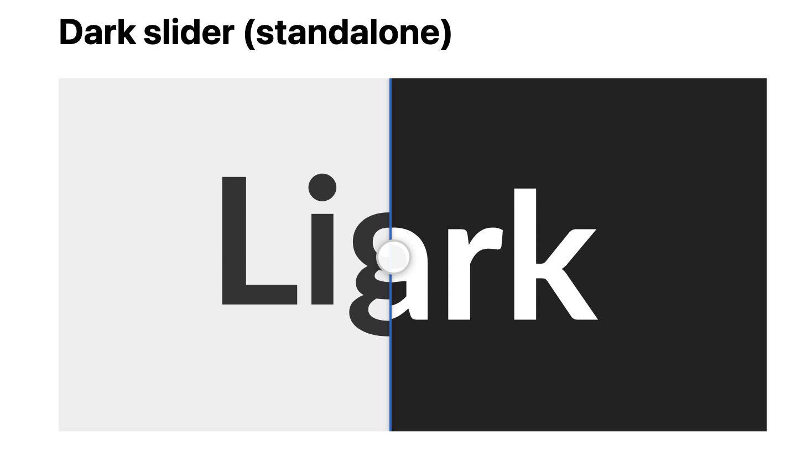

# Dark Slider — Jekyll light/dark image comparison

**Version 1.0.1**

Interactive before/after slider for posts and pages: drag a vertical handle to compare a **light** screenshot (left) with a **dark** screenshot (right).



## Demo

Light appears on the left of the handle; dark on the right. Drag the handle or use the keyboard-accessible range control.

## Installation

1. Copy `dark_slider_tag.rb` into your Jekyll `_plugins/` folder (or add this repo path under `plugins:` in `_config.yml`).

2. Copy [dark-slider.css](./dark-slider.css) and [dark-slider.js](./dark-slider.js) into your site (for example `assets/css/` and `assets/js/`).

3. Link them in your layout:

```html
<link rel="stylesheet" href="{{ '/assets/css/dark-slider.css' | relative_url }}">
<script src="{{ '/assets/js/dark-slider.js' | relative_url }}" defer></script>
```

`dark-slider.js` is vanilla JavaScript (no jQuery) and auto-initializes on `DOMContentLoaded`. You can also call `DarkSlider.init(document)` manually.

## Liquid usage

Pass the **light** image path. The dark image is derived by inserting `-dark` before the extension.

```liquid




```

### Initial position (optional, 0–100)

| Value | Result |
|-------|--------|
| `0` | Full dark (handle at left) |
| `100` | Full light (handle at right) |
| `50` | Default (omitted) |

Place the number before the path, after classes, or after the path (before quoted alt/caption).

### Required assets (same folder)

| File | Role |
|------|------|
| `screenshot1.jpg` | Light (tag argument) |
| `screenshot1-dark.jpg` | Dark (auto-derived) |

Optional retina: `screenshot1@2x.jpg`, `screenshot1-dark@2x.jpg` (PNG works the same way).

**Light and dark images must be the same dimensions.**

## Optional build-time formats

For local images under your Jekyll `source` folder, the tag can generate WebP and AVIF when tools are available:

| Tool | Install (macOS) | If missing |
|------|-----------------|------------|
| `cwebp` | `brew install webp` | One warning per build; JPEG/PNG still used |
| `avifenc` | `brew install libavif` | One warning per build; AVIF omitted |

Pre-built `.webp` / `.avif` files are used when present. Optional tool paths in `_config.yml`:

```yaml
dark_slider:
  cwebp: /opt/homebrew/bin/cwebp
  avifenc: /opt/homebrew/bin/avifenc
  identify: /opt/homebrew/bin/identify
```

Omit a key to use the executable from your `PATH`.

## HTML output

The tag emits a `figure.dark-slider` with layered `<picture>` elements (or `` for remote URLs), a range input, and a `<noscript>` fallback showing the light image when JavaScript is disabled.

Both layers render at full width; the light side is revealed with CSS `clip-path` so it stays aligned with the dark image at any display size.

## Changelog

### 1.0.1

- Fix light/dark images rendering at different scales (full-width layers + `clip-path` instead of a narrow overlay)
- Emit standard `<picture>` markup (sources are not wrapped in `<noscript>`, which hid images when JS was enabled)
- Simplify JavaScript (no per-pixel width sync; slider interaction unchanged)

### 1.0.0

- Initial release

## Files

| File | Purpose |
|------|---------|
| [dark_slider_tag.rb](./dark_slider_tag.rb) | Jekyll Liquid tag |
| [dark-slider.css](./dark-slider.css) | Styles (required) |
| [dark-slider.js](./dark-slider.js) | Interaction (required) |
| [DarkSlider.jpg](./DarkSlider.jpg) | Example screenshot |
| [fixture.html](./fixture.html) | Standalone browser test (no Jekyll) |
| [VERSION](./VERSION) | Current release version |

## Author

Brett Terpstra — [brettterpstra.com](https://brettterpstra.com)
