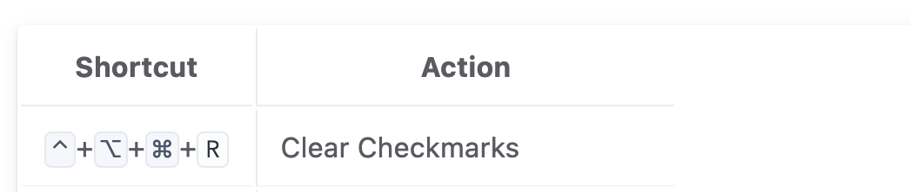
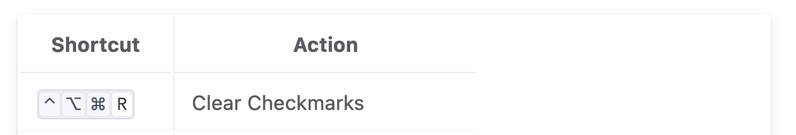

# Keyboard markup tag

Apply HTML markup for Mac keyboard shortcuts using flexible syntax. Results conform to Apple's style guide for modifier keys.

Settings allow output to be written out (as per Apple's preference) or use symbols (which I personally prefer).

Examples:

    |    Shortcut    |          Action          |
    |----------------|--------------------------|
    |  | Clear Checkmarks         |

Creates:

## Installation

Just drop the `kbd_tag.rb` file into your Jekyll plugins folder (`/_plugins` in most cases). Then you're ready to use the `` tag in your posts and pages.

## Configuration

In `_config.yml`, include a `kbd` section to determine formatting.

      kbd:
        # Use symbols for modifier keys (Command, Option, etc.). 
        # Apple's guidelines say to spell them out in most cases, 
        # but personally I prefer to use symbols.
        use_modifier_symbols: true

        # Use symbols for non-character keys (Home, PgUp, Right Arrow, etc.). 
        # Again, Apple recommends spelling these out. A lot of the symbols are 
        # unfamiliar to users, like Home (↖) or Escape (⎋). Your choice.
        use_key_symbols: true

        # When using symbols for modifiers, Apple recommends separating them 
        # with `+`. This looks like ⌘+⌥+C. Disable this to just output ⌘⌥C. 
        # Ignored if not using modifier symbols.
        use_plus_sign: true

With all symbols set to true and `use_plus_sign` disabled, output looks like this (using my default styling):

## Syntax

The tag is just ``. The key combo syntax is very flexible:

1. You can use the modifier keys that would be found in a keybinding PLIST.
    
    - `^` = Control
    - `~` = Option
    - `$` = Shift
    - `@` = Command
2. You can write out the names, common abbreviations are recognized
    
    - `ctrl`, `ctl`, `control` = Control
    - `cmd`, `command` = Command
    - `shift` = Shift
    - `opt`, `alt`, `option` = Option

3. When using symbols, no separation between characters is needed: ``
4. When using names, separate with either hyphen or space: `` or ``

Additional syntax:

* Multiple key combos can be separated by " / " (spaces required) within the tag and are output as multiple spans separated by "/"
    
        {% kbd cmd-h / cmd-? }
* Key names like "home" and "escape" are translated to characters or correct key name, depending on settings, common abbreviations allowed
        
    `` or `` will both work

    * "click" is translated to pointer symbol, requires fontawesome <https://fontawesome.com>

## Apple Style

Most of the rules from Apple's keyboard modifier style guide are applied.

* Sorts modifiers by Apple's menu display order (Control, Option, Shift, Command). You can write them in any order and output will be correct
* When not using symbols, keys are separated with `-`, e.g. "Shift-Command-?"
* When using symbols, keys are separated with `+` (separator can be disabled entirely in settings), e.g. "⌘+⌥+?"
* When no modifiers are present, shift is applied to uppercase keys ("F" = "Shift-F", "f" = "F")
* When shift modifier is used, keys using lower of 2-symbol keys switches to upper ("Shift-/" => "Shift-?")

## Output Markup

Symbols are replaced with HTML entities wherever possible. Markup is formatted to work well both visually and with screen readers.

Output has markup elements for each character, with appropriate classes, making CSS styling very flexible.

A title attribute applied to container span with natural language translation of symbols ("⇧⌘⎋" => "Shift-Command-Escape"), allowing the user to hover over the key combo and have it explained in a tooltip.

The output pictured above looks like this: 

    
        <kbd class="mod">&#8963;</kbd>+<kbd class="mod">&#8997;</kbd>+<kbd class="mod">&#8984;</kbd>+<kbd class="key">R</kbd>
    

If the key is a symbol, a class of `symbol` is applied to the `<kbd>` tag.

If the keys are separated by `-` or `+` (depending on settings), a class of `separated` is applied to the containing ``. If there's no separator, the class `combined` is applied.

## Styling

See `sass/kbd.scss` for the styling I use on my own sites, and modify it to suit your needs. It handles `Command-P` with different styling than `⌘P`, and should adapt to whatever output settings you use.
