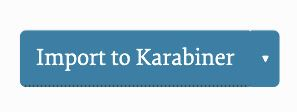
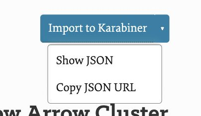
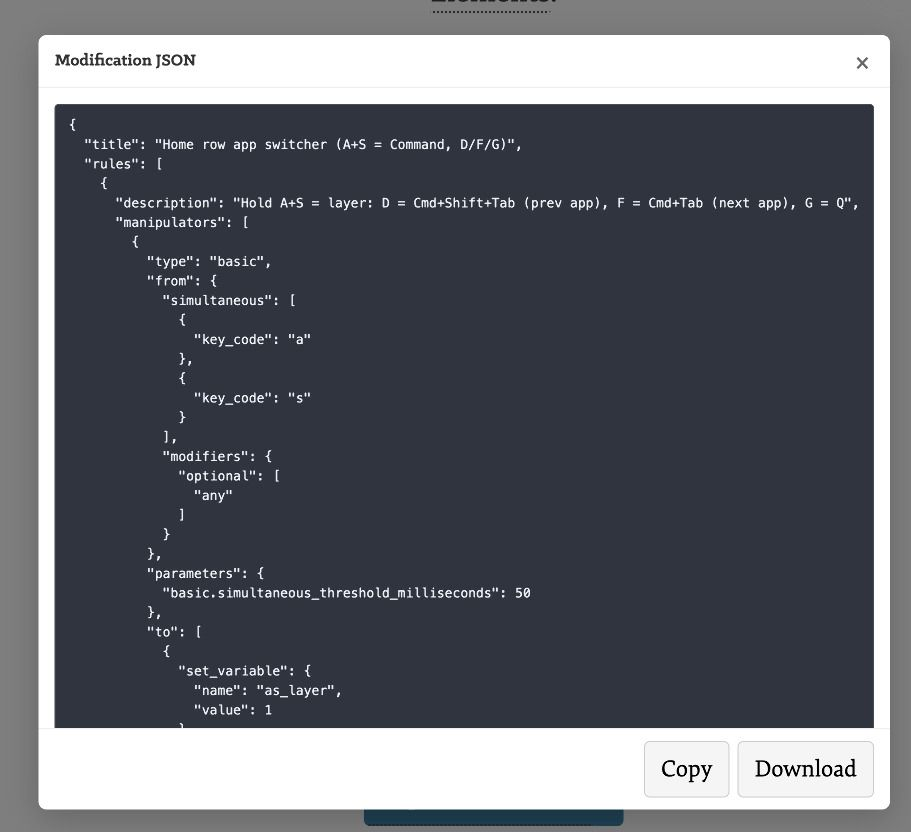

# Biner (Karabiner-Elements) Import Button Tag

A Jekyll plugin that outputs an "Import to Karabiner" split button for [Karabiner-Elements](https://karabiner-elements.pqrs.org/) complex modifications, with dropdown options to show or copy the JSON URL.

Karabiner Complex Modification files are JSON files in the format:

```json
{
  "title": "Home row app switcher (A+S = Command, D/F/G)",
  "rules": [
  ...
  ]
}
```

with individual rules in the `rules` array. You can have multiple rules in a modification. See the Karabiner docs for details.

## Installation

Add `biner.rb` to your Jekyll plugins directory.

## Configuration

Optionally, add a `biner` section to your `_config.yml` to set a custom base directory for your JSON files:

```yaml
biner:
  base_directory: https://yourdomain.com/karabiner/modifications
```

If not set, the default is:

```
https://brettterpstra.com/karabiner/modifications
```

Which won't be very useful to you, so you should set it.

## Usage

### By name (uses base_directory):

```liquid

```

This will generate a button for:

```
[base_directory]/home-row-app-switcher.json
```

### By path (starts with `/`):

```liquid

```

This will use the path verbatim, prepending your site URL.

## Output

The tag generates a split button:

- **Main button:** Opens Karabiner-Elements import dialog for the JSON
- **Dropdown:**
  - Show JSON (opens the JSON file in a modal)
  - Copy JSON URL (copies the URL to clipboard)

With the CSS below added to your site, you can get a button similar to:



With a dropdown like:



And clicking "Show JSON" reveals a modal:



with download and copy buttons.

## Suggested CSS

Add the following CSS to your site for proper styling:

```css
.biner-wrap {
  position: relative;
  display: inline-block;
}
.biner-btn-group {
  display: inline-flex;
  align-items: stretch;
  border-radius: 6px;
  overflow: hidden;
  box-shadow: 0 1px 3px rgba(0, 0, 0, 0.15);
}
.biner-btn-main {
  display: inline-flex;
  align-items: center;
  padding: 8px 16px;
  background: #007aff;
  color: #fff;
  text-decoration: none;
  font-weight: 500;
}
.biner-btn-main:hover {
  background: #0056b3;
  color: #fff;
}
.biner-btn-dropdown-toggle {
  display: inline-flex;
  align-items: center;
  justify-content: center;
  padding: 8px 10px;
  background: #007aff;
  border: none;
  border-left: 1px solid rgba(255, 255, 255, 0.3);
  color: #fff;
  cursor: pointer;
}
.biner-btn-dropdown-toggle:hover {
  background: #0056b3;
}
.biner-chevron {
  font-size: 10px;
  line-height: 1;
}
.biner-dropdown-menu {
  position: absolute;
  top: 100%;
  left: 0;
  margin-top: 4px;
  min-width: 160px;
  background: #fff;
  border: 1px solid #ddd;
  border-radius: 6px;
  box-shadow: 0 4px 12px rgba(0, 0, 0, 0.15);
  padding: 4px 0;
  z-index: 100;
}
.biner-dropdown-menu[hidden] {
  display: none !important;
}
.biner-dropdown-item {
  display: block;
  width: 100%;
  padding: 8px 16px;
  text-align: left;
  background: none;
  border: none;
  font: inherit;
  color: #333;
  text-decoration: none;
  cursor: pointer;
}
.biner-dropdown-item:hover {
  background: #f5f5f5;
}
```

Alternatively, use the included `_biner.scss` file.
